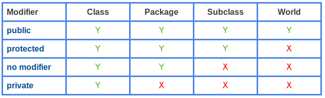

# Java Access Level for Members: public, protected, private

Java access level contains two parts: 1) access level for classes and 2) access level for members.

For class access level, the keyword can be public or no explicit modifier(package-private). For member access level, the keyword can be `public`, `protected`, `package-private` (no explicit modifier), or `private`.

The following table summarizes the access level of different modifiers for members. Access level determines the accessibility of fields and methods. It has 4 levels: public, protected, package-private (no explicit modifier), or private.

