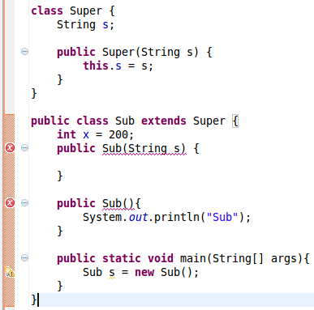
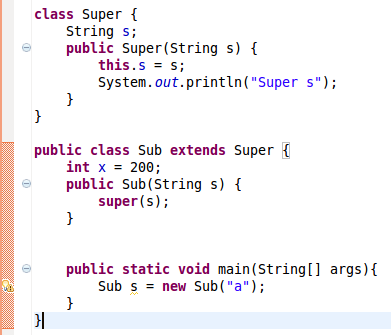

# Constructors of Sub and Super Classes in Java
This post summarizes a commonly asked question about Java constructors.


## Why creating an object of the sub class invokes also the constructor of the super class?
```
class Super {
    String s;
 
    public Super(){
    	System.out.println("Super");
    }
}
 
public class Sub extends Super {
 
    public Sub(){
    	System.out.println("Sub");
    }
 
    public static void main(String[] args){
    	Sub s = new Sub();
    }
}
```
It prints:
```
Super
Sub
```
When inheriting from another class, super() has to be called first in the constructor. If not, the compiler will insert that call. This is why super constructor is also invoked when a Sub object is created.

This doesn't create two objects, only one Sub object. The reason to have super constructor called is that if super class could have private fields which need to be initialized by its constructor.

After compiler inserts the super constructor, the sub class constructor looks like the following:
```
    public Sub(){
    	super();
    	System.out.println("Sub");
    }
```
## A Common Error Message: Implicit super constructor is undefined for default constructor

This is a compilation error message seen by a lot of Java developers:

>"Implicit super constructor is undefined for default constructor. Must define an explicit constructor"




This compilation error occurs because the default super constructor is undefined. In Java, if a class does not define a constructor, compiler will insert a default no-argument constructor for the class by default. If a constructor is defined in Super class, in this case Super(String s), compiler will not insert the default no-argument constructor. This is the situation for the Super class above.

The constructors of the Sub class, either with-argument or no-argument, will call the no-argument Super constructor. Since compiler tries to insert super() to the 2 constructors in the Sub class, but the Super's default constructor is not defined, compiler reports the error message.

To fix this problem, simply 1) add a Super() constructor to the Super class like
```
public Super(){
    System.out.println("Super");
}
```
, or 2) remove the self-defined Super constructor, or 3) add super(value) to sub constructors.

## Explicitly call super constructor in sub constructor



The Sub constructor explicitly call the super constructor with parameter. The super constructor is defined, and good to invoke.

## The Rule

In brief, the rules is: sub class constructor has to invoke super class instructor, either explicitly by programmer or implicitly by compiler. For either way, the invoked super constructor has to be defined.