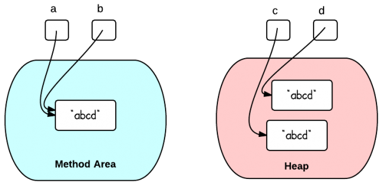

# Create Java String Using ” ” or Constructor?

In Java, a string can be created by using two methods:
```
String x = "abc";
String y = new String("abc");
```
What is the difference between using double quotes and using constructor?
## Double Quotes vs. Constructor

This question can be answered by using two simple code examples.

Example 1:
```
String a = "abcd";
String b = "abcd";
System.out.println(a == b);  // True
System.out.println(a.equals(b)); // True
```
`a==b `is true because a and b are referring to the same string literal in the method area. The memory references are the same.

When the same string literal is created more than once, only one copy of each distinct string value is stored. This is called "string interning". All compile-time constant strings in Java are automatically interned.

Example 2:
```
String c = new String("abcd");
String d = new String("abcd");
System.out.println(c == d);  // False
System.out.println(c.equals(d)); // True
```
`c==d` is false because c and d refer to two different objects in the heap. Different objects always have different memory references.

This diagram illustrate the two situations above:


## Run-Time String Interning

Thanks to LukasEder (his comment below):

String interning can still be done at run-time, even if two strings are constructed with constructors:
```
String c = new String("abcd").intern();
String d = new String("abcd").intern();
System.out.println(c == d);  // Now true
System.out.println(c.equals(d)); // True
```
## When to Use Which

Because the literal "abcd" is already of type String, using constructor will create an extra unnecessary object. 

>Therefore, double quotes should be used if you just need to create a String.

>If you do need to create a new object in the heap, constructor should be used. 