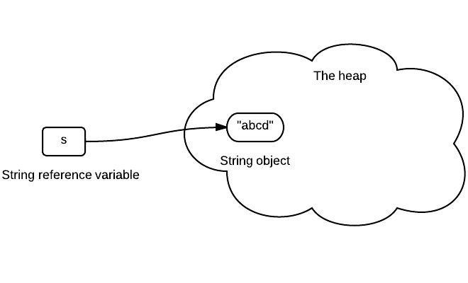
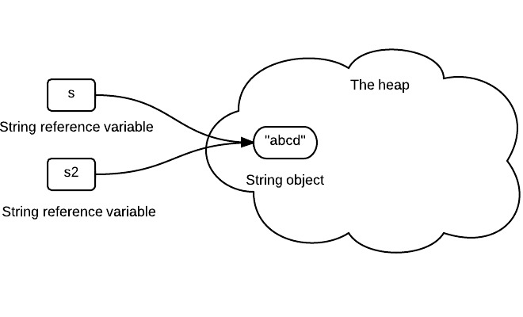
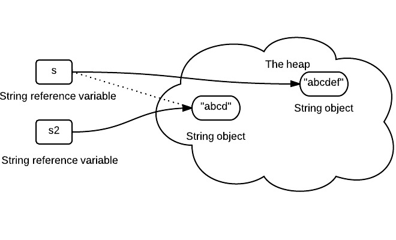

# Diagram to show Java String’s Immutability

## Declare a string
```
String s = "abcd";
```
s stores the reference of the string object. The arrow below should be interpreted as "store reference of".



## Assign one string variable to another string
```
String s2 = s;
```
s2 stores the same reference value, since it is the same string object.



## Concat string
```
s = s.concat("ef");
```
s now stores the reference of newly created string object.



## Summary
Once a string is created in memory(heap), it can not be changed. We should note that all methods of String do not change the string itself, but rather return a new String.

If we need a string that can be modified, we will need StringBuffer or StringBuilder. Otherwise, there would be a lot of time wasted for Garbage Collection, since each time a new String is created. Here is an example of StringBuilder usage.