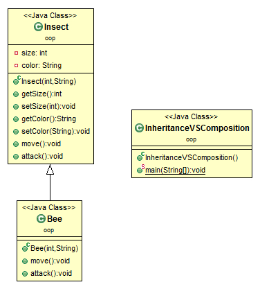
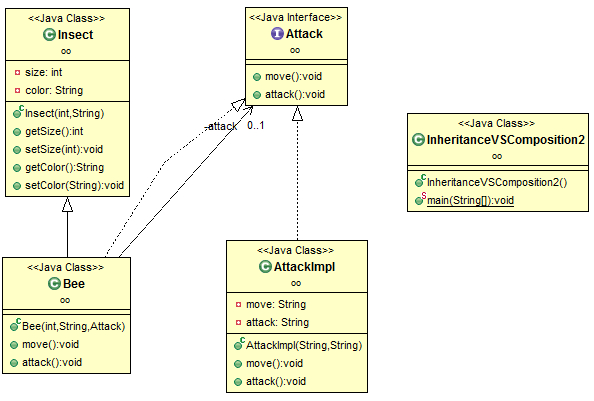

# Inheritance vs. Composition in Java

## Inheritance

Let's suppose we have an Insect class. This class contains two methods: 1) move() and 2) attack().
```
class Insect {
	private int size;
	private String color;
 
	public Insect(int size, String color) {
		this.size = size;
		this.color = color;
	}
 
	public int getSize() {
		return size;
	}
 
	public void setSize(int size) {
		this.size = size;
	}
 
	public String getColor() {
		return color;
	}
 
	public void setColor(String color) {
		this.color = color;
	}
 
	public void move() {
		System.out.println("Move");
	}
 
	public void attack() {
		move(); //assuming an insect needs to move before attacking
		System.out.println("Attack");
	}
}
```
Now you want to define a `Bee` class, which is a type of Insect, but have different implementations of `attack()` and `move()`. This can be done by using an inheritance design like the following:
```
class Bee extends Insect {
	public Bee(int size, String color) {
		super(size, color);
	}
 
	public void move() {
		System.out.println("Fly");
	}
 
	public void attack() {
		move();
		super.attack();
	}
}
```
```
public class InheritanceVSComposition {
	public static void main(String[] args) {
		Insect i = new Bee(1, "red");
		i.attack();
	}
}
```
The class hierarchy diagram is as simple as:


out:
```
Fly
Fly
Attack
```
Fly" was printed twice, which indicates move() is called twice. But it should be called only ONCE.

The problem is caused by the `super.attack()` method. The attack() method of Insect invokes `move()` method. When the subclass calls `super.attack()`, it also invokes the overridden move() method.

To fix the problem, we can:

1. eliminate the subclass's attack() method. This will make the subclass depends on the superclass's implementation of attack(). If the attack() method in the superclass is changed later (which is out of your control), e.g., the superclass's attack() method use another method to move, the subclass will need to be changed too. This is bad encapsulation.
2. rewrite the attack() method like the following:
```
public void attack() {
	move();
	System.out.println("Attack");
}
```
This would guarantee the correct result, because the subclass is not dependent on the superclass any more. However, the code is the duplicate of the superclass. (Image attack() method does complex things other than just printing a string) This does not following software engineering rule of reusing.

This inheritance design is bad, because the subclass depends on the implementation details of its superclass. If the superclass changes, the subclass may break.

## Composition

Instead of inheritance, composition can be used in this case. Let's first take a look at the composition solution.

The attack function is abstracted as an interface.
```
interface Attack {
	public void move();
	public void attack();
}
```
Different kinds of attack can be defined by implementing the Attack interface.
```
class AttackImpl implements Attack {
	private String move;
	private String attack;
 
	public AttackImpl(String move, String attack) {
		this.move = move;
		this.attack = attack;
	}
 
	@Override
	public void move() {
		System.out.println(move);
	}
 
	@Override
	public void attack() {
		move();
		System.out.println(attack);
	}
}
```
Since the attack function is extracted, Insect does not do anything related with attack any longer.
```
class Insect {
	private int size;
	private String color;
 
	public Insect(int size, String color) {
		this.size = size;
		this.color = color;
	}
 
	public int getSize() {
		return size;
	}
 
	public void setSize(int size) {
		this.size = size;
	}
 
	public String getColor() {
		return color;
	}
 
	public void setColor(String color) {
		this.color = color;
	}
}
```
Bee is a type of Insect, it can attack.
```
// This wrapper class wrap an Attack object
class Bee extends Insect implements Attack {
	private Attack attack;
 
	public Bee(int size, String color, Attack attack) {
		super(size, color);
		this.attack = attack;
	}
 
	public void move() {
		attack.move();
	}
 
	public void attack() {
		attack.attack();
	}
}
```
Class Diagram:



```
public class InheritanceVSComposition2 {
	public static void main(String[] args) {
		Bee a = new Bee(1, "black", new AttackImpl("fly", "move"));
		a.attack();
 
		// if you need another implementation of move()
		// there is no need to change Insect, we can quickly use new method to attack
 
		Bee b = new Bee(1, "black", new AttackImpl("fly", "sting"));
		b.attack();
	}
}
```
```
fly
move
fly
sting
```
###3.4.3 When to Use Which?

The following two items can guide the selection between inheritance and composition:

1. If there is an IS-A relation, and a class wants to expose all the interface to another class, inheritance is likely to be preferred.
2. If there is a HAS-A relationship, composition is preferred.
In summary, Inheritance and composition both have their uses, and it pays to understand their relative merits.