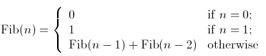

# Iteration vs. Recursion in Java

## Recursion

Consider the factorial function: `n!=n*(n-1)*(n-2)*...*1`

There are many ways to compute factorials. One way is that n! is equal to n*(n-1)!. Therefore the program can be directly written as:

Program 1:
```
int factorial (int n) {
    if (n == 1) {
        return 1;
    } else {
        return n*factorial(n-1);
    }
}
```

n order to run this program, the computer needs to build up a chain of multiplications:` factorial(n) → factorial(n-1) → factorial(n-2) → ... → factorial(1)`. Therefore, the computer has to keep track of the multiplications to be performed later on. This type of program, characterized by a chain of operations, is called recursion. Recursion can be further categorized into linear and tree recursion. When the amount of information needed to keep track of the chain of operations grows linearly with the input, the recursion is called linear recursion. The computation of n! is such a case, because the time required grows linearly with n. Another type of recursion, tree recursion, happens when the amount of information grows exponentially with the input. But we will leave it undiscussed here and go back shortly afterwards.

## Iteration

A different perspective on computing factorials is by first multiplying 1 by 2, then multiplying the result by 3, then by 4, and so on until n. More formally, the program can use a counter that counts from 1 up to n and compute the product simultaneously until the counter exceeds n. Therefore the program can be written as:

Program 2:
```
int factorial (int n) {
    int product = 1;
    for(int i=2; i<n; i++) {
        product *= i;
    }
    return product;
}
```
This program, by contrast to program 2, does not build a chain of multiplication. At each step, the computer only need to keep track of the current values of the product and i. This type of program is called iteration, whose state can be summarized by a fixed number of variables, a fixed rule that describes how the variables should be updated, and an end test that specifies conditions under which the process should terminate. Same as recursion, when the time required grows linearly with the input, we call the iteration linear recursion.

## Recursion vs Iteration

Compared the two processes, we can find that they seem almost same, especially in term of mathematical function. They both require a number of steps proportional to n to compute n!. On the other hand, when we consider the running processes of the two programs, they evolve quite differently.

In the iterative case, the program variables provide a complete description of the state. If we stopped the computation in the middle, to resume it only need to supply the computer with all variables. However, in the recursive process, information is maintained by the computer, therefore "hidden" to the program. This makes it almost impossible to resume the program after stopping it.

## Tree recursion

As described above, tree recursion happens when the amount of information grows exponentially with the input. For instance, consider the sequence of Fibonacci numbers defined as follows:



By the definition, Fibonacci numbers have the following sequence, where each number is the sum of the previous two: 0, 1, 1, 2, 3, 5, 8, 13, 21, ...

A recursive program can be immediately written as:

Program 3:
```
int fib (int n) {
    if (n == 0) {
        return 0;
    } else if (n == 1) {
        return 1;
    } else {
        return fib(n-1) + fib(n-2);
    }
}
```

On the other hand, we can also write the program in an iterative way for computing the Fibonacci numbers. Program 4 is a linear iteration. The difference in time required by Program 3 and 4 is enormous, even for small inputs.

Program 4:
```
int fib (int n) {
    int fib = 0;
    int a = 1;
    for(int i=0; i<n; i++) {
       fib = fib + a;
       a = fib;
    }
    return fib;
}
```
However, one should not think tree-recursive programs are useless. When we consider programs that operate on hierarchically data structures rather than numbers, tree-recursion is a natural and powerful tool. It can help us understand and design programs. Compared with Program 3 and 4, we can easily tell Program 3 is more straightforward, even if less efficient. After that, we can most likely reformulate the program into an iterative way.