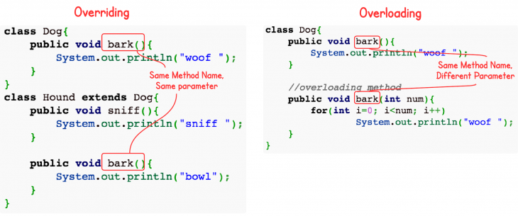

# Overriding vs. Overloading in Java



Overriding and Overloading are two very important concepts in Java. They are confusing for Java novice programmers. This post illustrates their differences by using two simple examples.

## Definitions

`Overloading` occurs when two or more methods in one class have the same method name but different parameters.

`Overriding` means having two methods with the same method name and parameters (i.e., method signature). One of the methods is in the parent class and the other is in the child class. Overriding allows a child class to provide a specific implementation of a method that is already provided its parent class.

## Overriding vs. Overloading

Here are some important facts about Overriding and Overloading:

1. Real object type, not the reference variable's type, determines which overridden method is used at runtime. In contrast, reference type determines which overloaded method will be used at compile time.
2. Polymorphism applies to overriding, not to overloading.
3. Overriding is a run-time concept while overloading is a compile-time concept.

## An Example of Overriding

Here is an example of overriding. After reading the code, guess the output.
```
class Dog{
    public void bark(){
        System.out.println("woof ");
    }
}
class Hound extends Dog{
    public void sniff(){
        System.out.println("sniff ");
    }
 
    public void bark(){
        System.out.println("bowl");
    }
}
 
public class OverridingTest{
    public static void main(String [] args){
        Dog dog = new Hound();
        dog.bark();
    }
}
```
Output:
```
bowl
```
In the example above, the dog variable is declared to be a Dog. During compile time, the compiler checks if the Dog class has the bark() method. As long as the Dog class has the bark() method, the code compilers. At run-time, a Hound is created and assigned to dog. The JVM knows that dog is referring to the object of Hound, so it calls the bark() method of Hound. This is called Dynamic Polymorphism.

## An Example of Overloading
```
class Dog{
    public void bark(){
        System.out.println("woof ");
    }
 
    //overloading method
    public void bark(int num){
    	for(int i=0; i<num; i++)
    		System.out.println("woof ");
    }
}
```
In this overloading example, the two bark method can be invoked by using different parameters. Compiler know they are different because they have different method signature (method name and method parameter list).