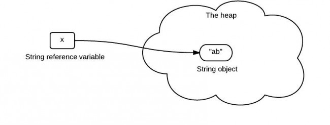
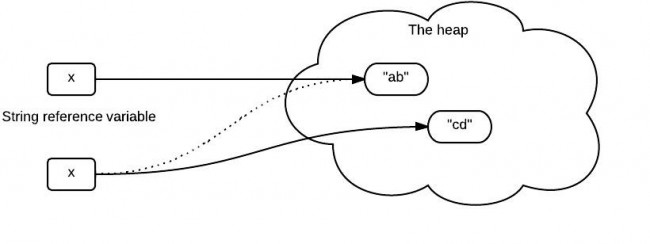

# String is passed by “reference” in Java
this is a classic question of Java. Many similar questions have been asked on stackoverflow, and there are a lot of incorrect/incomplete answers. The question is simple if you don't think too much. But it could be very confusing, if you give more thought to it.

## A code fragment that is interesting & confusing
```
public static void main(String[] args) {
	String x = new String("ab");
	change(x);
	System.out.println(x);
}
 
public static void change(String x) {
	x = "cd";
}
```
It prints "ab".

In C++, the code is as follows:
```
void change(string &x) {
    x = "cd";
}
 
int main(){
    string x = "ab";
    change(x);
    cout << x << endl;
}
```
it prints "cd".

## Common confusing questions

x stores the reference which points to the "ab" string in the heap. So when x is passed as a parameter to the change() method, it still points to the "ab" in the heap like the following:


It seems to be a pretty reasonable explanation. They are clear that Java is always pass-by-value. But what is wrong here?

## What the code really does?

The explanation above has several mistakes. To understand this easily, it is a good idea to briefly walk though the whole process.

When the string "ab" is created, Java allocates the amount of memory required to store the string object. Then, the object is assigned to variable x, the variable is actually assigned a reference to the object. This reference is the address of the memory location where the object is stored.

The variable x contains a reference to the string object. x is not a reference itself! It is a variable that stores a reference(memory address).

**Java is pass-by-value ONLY**. When x is passed to the change() method, a copy of value of x (a reference) is passed. The method change() creates another object "cd" and it has a different reference. It is the variable x that changes its reference(to "cd"), not the reference itself.

The following diagram shows what it really does.


## The wrong explanation

The problem raised from the first code fragment is nothing related with string immutability. Even if String is replaced with StringBuilder, the result is still the same. The key point is that variable stores the reference, but is not the reference itself!

## Solution to this problem

If we really need to change the value of the object. First of all, the object should be changeable, e.g., StringBuilder. Secondly, we need to make sure that there is no new object created and assigned to the parameter variable, because Java is passing-by-value only.
```
public static void main(String[] args) {
	StringBuilder x = new StringBuilder("ab");
	change(x);
	System.out.println(x);
}
 
public static void change(StringBuilder x) {
	x.delete(0, 2).append("cd");
}
```