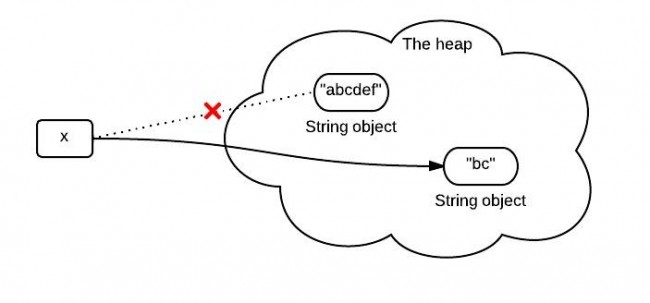
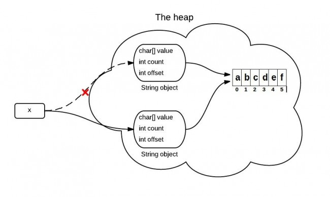
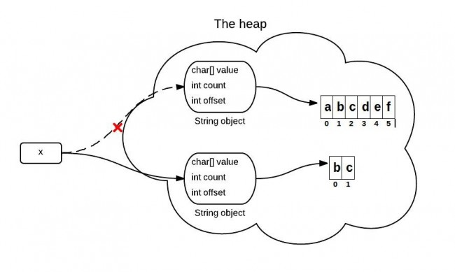

# The substring() Method in JDK 6 and JDK 7
The substring(int beginIndex, int endIndex) method in JDK 6 and JDK 7 are different. Knowing the difference can help you better use them. For simplicity reasons, in the following substring() represent the substring(int beginIndex, int endIndex) method.

## what substring() does?
The substring(int beginIndex, int endIndex) method returns a string that starts with beginIndex and ends with endIndex-1.

```
String x = "abcdef";
x = x.substring(1,3);
System.out.println(x);
```
## What happens when substring() is called?

You may know that because x is immutable, when x is assigned with the result of x.substring(1,3), it points to a totally new string like the following:



However, this diagram is not exactly right or it represents what really happens in the heap. What really happens when substring() is called is different between JDK 6 and JDK 7.

## substring() in JDK 6

String is supported by a char array. In JDK 6, the String class contains 3 fields: char value[], int offset, int count. They are used to store real character array, the first index of the array, the number of characters in the String.

When the substring() method is called, it creates a new string, but the string's value still points to the same array in the heap. The difference between the two Strings is their count and offset values.



The following code is simplified and only contains the key point for explain this problem.
```
//jdk 6
String(int offset,int count,char value[]){
    this.value = value;
    this.offset = offset;
    this.count = count;
}

public String substring(int beginIndex, int endIndex) {
	//check boundary
	return  new String(offset + beginIndex, endIndex - beginIndex, value);
}
```

## A problem caused by substring() in JDK 6

If you have a VERY long string, but you only need a small part each time by using substring(). This will cause a performance problem, since you need only a small part, you keep the whole thing. For JDK 6, the solution is using the following, which will make it point to a real sub string:
```
x = x.substring(x, y) + ""
```


```
//JDK 7
public String(char value[], int offset, int count) {
	//check boundary
	this.value = Arrays.copyOfRange(value, offset, offset + count);
}
 
public String substring(int beginIndex, int endIndex) {
	//check boundary
	int subLen = endIndex - beginIndex;
	return new String(value, beginIndex, subLen);
}
```