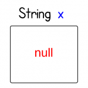

# What exactly is null in Java?
Let's start from the following statement:
```
String x = null;
```
## What exactly does this statement do?

Recall what is a variable and what is a value. A common metaphor is that a variable is similar to a box. Just as you can use a box to store something, you can use a variable to store a value. When declaring a variable, we need to set its type.

There are two major categories of types in Java: primitive and reference. Variables declared of a primitive type store values; variables declared of a reference type store references. In this case, the initialization statement declares a variables “x”. “x” stores String reference. It is null here.

The following visualization gives a better sense about this concept.



If x = "abc", it looks like the following:


## What exactly is null in memory?

What exactly is null in memory? Or What is the null value in Java?

First of all, null is not a valid object instance, so there is no memory allocated for it. It is simply a value that indicates that the object reference is not currently referring to an object.

From JVM Specifications:

>The Java Virtual Machine specification does not mandate a concrete value encoding null.

I would assume it is all zeros of something similar like itis on other C like languages.

## What exactly is x in memory?

Now we know what null is. And we know a variable is a storage location and an associated symbolic name (an identifier) which contains some value. Where exactly x is in memory?

From the diagram of JVM run-time data areas, we know that since each method has a private stack frame within the thread's steak, the local variable are located on that frame.