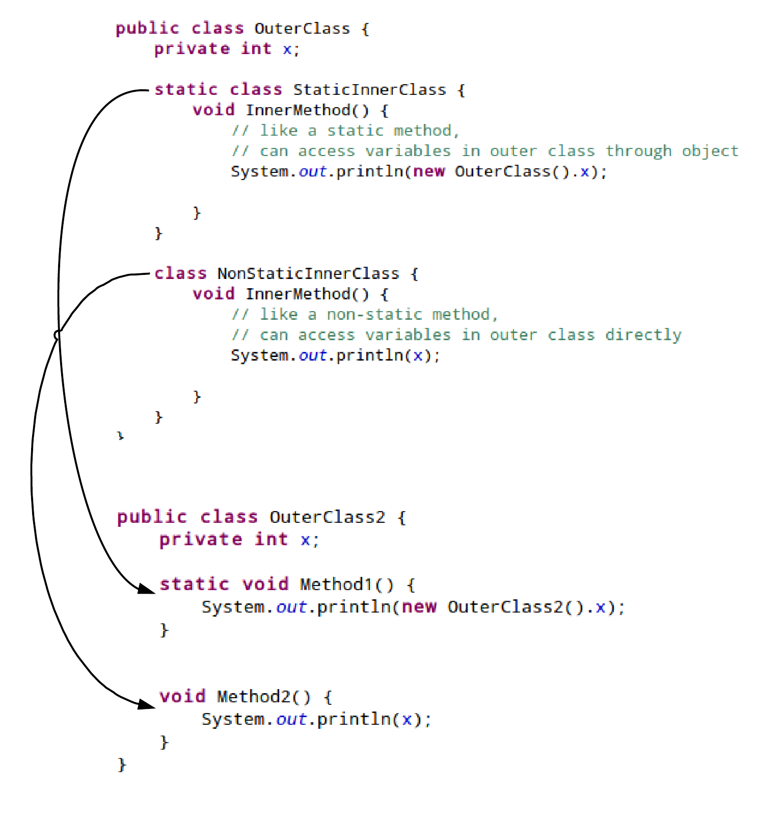

# What is Inner Interface in Java?

## What is Inner Interface in Java?
Inner interface is also called nested interface, which means declare an interface inside of another interface. For example, the Entry interface is declared in the Map interface.
```
public interface Map {
	interface Entry{
		int getKey();
	}
 
	void clear();
}
```
## Why Use Inner Interface?

There are several compelling reasons for using inner interface:

+ It is a way of logically grouping interfaces that are only used in one place.
+ It increases encapsulation.
+ Nested interfaces can lead to more readable and maintainable code.

One example of inner interface used in java standard library is java.util.Map and Java.util.Map.Entry. Here java.util.Map is used also as a namespace. Entry does not belong to the global scope, which means there are many other entities that are Entries and are not necessary Map's entries. This indicates that Entry represents entries related to the Map.

## How Inner Interface Works?

To figure out how inner interface works, we can compare it with nested classes. Nested classes can be considered as a regular method declared in outer class. Since a method can be declared as static or non-static, similarly nested classes can be static and non-static. Static class is like a static method, it can only access outer class members through objects. Non-static class can access any member of the outer class.



Because an interface can not be instantiated, the inner interface only makes sense if it is static. Therefore, by default inter interface is static, no matter you manually add static or not.

## A Simple Example of Inner Interface?

Map.java
```
public interface Map {
	interface Entry{
		int getKey();
	}
 
	void clear();
}
```
MapImpl.java
```
public class MapImpl implements Map {
 
 
	class ImplEntry implements Map.Entry{
		public int getKey() {
			return 0;
		}		
	}
 
	@Override
	public void clear() {
		//clear
	}
}
```