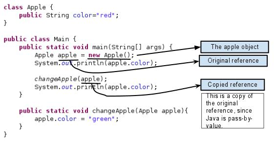
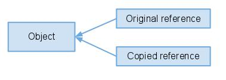

# Yet Another “Java Passes By Reference or By Value”?

This is a classic interview question which confuses novice Java developers. In this post I will use an example and some diagram to demonstrate that: Java is pass-by-value.

## Some Definitions

Pass by value: make a copy in memory of the actual parameter's value that is passed in.
Pass by reference: pass a copy of the address of the actual parameter.

>Java is always pass-by-value. Primitive data types and object reference are just values.

## Passing Primitive Type Variable

Since Java is pass-by-value, it's not hard to understand the following code will not swap anything.
```
swap(Type arg1, Type arg2) {
    Type temp = arg1;
    arg1 = arg2;
    arg2 = temp;
}
```
## Passing Object Variable

Java manipulates objects by reference, and all object variables are references. However, Java doesn't pass method arguments by reference, but by value.

Question is: why the member value of the object can get changed?



code:
```
class Apple {
	public String color="red";
}
 
public class Main {
	public static void main(String[] args) {
		Apple apple = new Apple();
		System.out.println(apple.color);
 
		changeApple(apple);
		System.out.println(apple.color);
	}
 
	public static void changeApple(Apple apple){
		apple.color = "green";
	}
}
```
Since the orignal and copied reference refer the same object, the member value gets changed.



output:
```
red
green
```